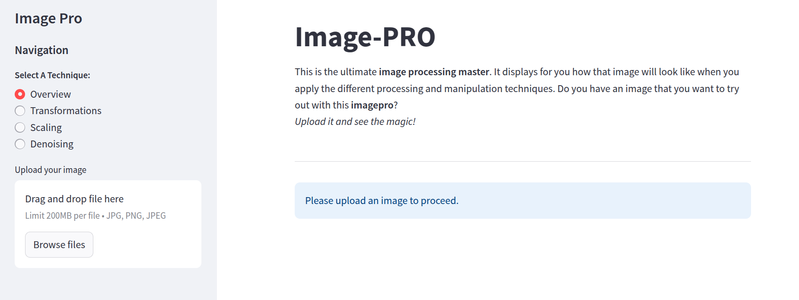
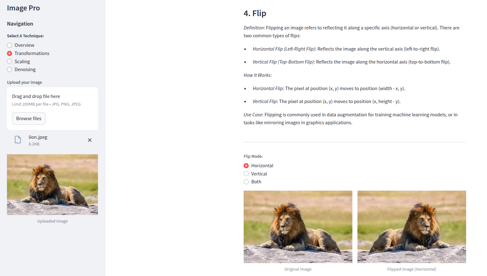

## Image Processing App

### Overview

This application provides an interactive interface for performing basic image processing operations using OpenCV. It is built with Streamlit, allowing users to upload images, apply various transformations, and view results in real time. The app is designed for educational purposes, experimentation, and prototyping image manipulation tasks.

### Features

#### 1. Basic Analysis

- Displays image dimensions (Height, Width, Depth).
- Visualizes histograms for grayscale and color images.

#### 2. Transformations

- **Translation**: Shift the image horizontally and/or vertically.
- **Rotation**: Rotate the image by a specified angle with adjustable scaling.
- **Transpose**: Swap rows and columns in the image.
- **Flip**: Flip the image horizontally, vertically, or both.

#### 3. Scaling

- Perform rescaling, resizing, interpolation and cropping operations.
- Experiment with interpolation methods like Nearest Neighbor, Bilinear, and Bicubic.

#### 4. Denoising

Apply smoothing techniques:

- Averaging
- Median Filtering
- Gaussian Blurring
- Non-Local Means (NLM) Filtering

#### 5. Real-Time Interactivity

- Adjust parameters using sliders and drop-downs.
- Compare original and processed images side by side.

# ---

### Installation

Clone the repository:

```
git clone https://github.com/fonyango/image-pro.git
cd image-pro
```

Install required packages:

`pip install -r requirements.txt`

Run the app:

`streamlit run app.py`

# ---

### Usage

Upload an image **(JPG, PNG, or JPEG format)** through the sidebar.
Navigate through pages to explore different image processing functionalities:

- *Overview* for histogram and metadata.
- *Transformations* for translating, rotating, transposing, and flipping.
- *Scaling* for scaling and interpolation.
- *Denoising* for smoothing and noise reduction.

Adjust settings via sliders and options to see real-time results.

# ---

### Web Page

[Image Pro](https://image-master.streamlit.app/)



*Fig. 1. Landing page*



*Fig. 2. Image transformation through horizontal flipping*

## ---

### Author

Developed by **Francis Onyango**.

Feel free to reach out for collaborations or feedback! 😊